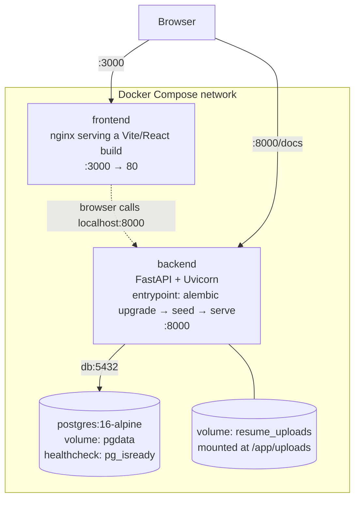

# HireHub

A focused, production-quality HR job portal — think a scoped-down Naukri.com. Two
roles, HR and Candidate, each with their own dashboard, workflows, and a backend
that enforces every permission the frontend implies (never the other way around).

## Features

**Candidate**
- Register / login / logout
- Search and filter jobs (title/keyword, location, skills, employment type, years of experience)
- View job details, apply (duplicate applications rejected at the database level, not just in application code)
- Track application status (Applied / Shortlisted / Rejected)
- Edit profile (headline, skills, experience, location, phone)
- Upload a resume (PDF, validated by content and size, not just file extension) and view it back
- Inbox for one-way notices from recruiters (not real email — see [Known Limitations](#known-limitations))
- Dashboard with an application-status chart

**HR**
- Register / login / logout, company profile (name, designation)
- Post, edit, and activate/deactivate jobs
- View applicants per job, sorted by an ATS match score (see below), with filters for
  status, experience range, skills, location, and match rating
- Multi-select applicants for one-click bulk shortlist/reject
- Browse a global candidate directory (search/filter by name, skills, location,
  experience), view any candidate's full profile and resume
- Bulk-message selected candidates from the directory (with message templates)
- Dashboard with application-status and 14-day applications-received charts

### ATS match score

Each applicant gets a 1–5 star rating shown on the Applicants page. This is a
transparent heuristic, **not resume-parsing or NLP** — the app never extracts text
from the uploaded PDF, only structured profile data the candidate entered
(skills, headline, years of experience). The score weights skills-array overlap
(50%), free-text keyword overlap between the job's title/description and the
candidate's headline/skills (30%), and experience-range fit (20%). See
`backend/app/core/ats.py` for the exact algorithm.

## Architecture



The backend connects to Postgres via the Docker service name (`db:5432`), never
`localhost` — the frontend, by contrast, is a static bundle that runs in the
*browser*, which is outside the Docker network, so it calls the backend at
`localhost:8000` (baked in at build time via `VITE_API_URL`).

## Tech stack

| Layer | Choice |
|---|---|
| Frontend | React, TypeScript, Vite, React Router, Axios, Tailwind CSS |
| Backend | Python, FastAPI, SQLAlchemy 2.0, Pydantic v2, Alembic, PyJWT, bcrypt |
| Database | PostgreSQL 16 |
| Infra | Docker, Docker Compose |

A modular monolith throughout — no microservices, no message queue, no
Elasticsearch. See [Future Improvements](#future-improvements) for how search
would scale past Postgres `ILIKE` if it ever needed to.

## Project structure

```
HR-job-portal/
├── docker-compose.yml
├── .env.example
├── backend/
│   ├── Dockerfile
│   ├── entrypoint.sh        # alembic upgrade → seed demo data → uvicorn
│   ├── alembic/              # migrations
│   ├── app/
│   │   ├── core/              # config, security (JWT/bcrypt), ATS scoring, storage, error handlers
│   │   ├── db/                 # session, declarative base
│   │   ├── models/              # SQLAlchemy models
│   │   ├── schemas/              # Pydantic request/response models
│   │   ├── routers/               # FastAPI routers (thin — delegate to services)
│   │   ├── services/               # business logic + ownership/authorization checks
│   │   └── seed.py                  # idempotent demo-data seeding
│   └── tests/                        # pytest, against a real Postgres test database
└── frontend/
    ├── Dockerfile                     # multi-stage: node builder → nginx
    └── src/
        ├── api/                        # one module per backend resource
        ├── components/                  # shared UI (incl. hand-rolled SVG charts)
        ├── context/                      # auth context (JWT in localStorage)
        ├── pages/{public,candidate,hr}/   # one file per page
        └── routes/                         # role-gated route guards
```

## Setup

```bash
git clone <repo-url>
cd HR-job-portal
cp .env.example .env
docker compose up --build
```

That's it — Postgres starts, the backend waits for it to report healthy, runs
migrations, seeds demo data (idempotently — safe to restart), then starts serving;
the frontend builds and serves alongside it. No local Python, Node, or
PostgreSQL install is needed.

To start completely fresh (wipes the database and uploaded resumes):

```bash
docker compose down -v
docker compose up --build
```

### URLs

| Service | URL |
|---|---|
| Frontend | http://localhost:3000 |
| Backend API | http://localhost:8000 |
| Swagger / OpenAPI docs | http://localhost:8000/docs |
| Postgres (for a local client, e.g. `psql`) | `localhost:5433` (loopback-only; mapped to a non-default host port since 5432 is often already taken locally) |

### Test credentials

| Role | Email | Password |
|---|---|---|
| HR | `hr@test.com` | `Hr@12345` |
| HR (second account, different company) | `hr2@test.com` | `Hr2@12345` |
| Candidate | `candidate@test.com` | `Candidate@12345` |
| Candidate (second account) | `candidate2@test.com` | `Candidate2@12345` |

The seed also creates 20 additional candidates (`candidate3@test.com` through
`candidate22@test.com`, all with password `Password123`) and 5 more jobs, purely
so the candidate directory and job search have enough rows to demonstrate
pagination — they aren't meant to be individually memorable accounts.

## Feature walkthrough

1. **Log in as `candidate@test.com`.** The dashboard shows application counts
   and a status chart. Priya (this account) already has an uploaded resume and
   one unread inbox message from HR — both seeded so the features are visible
   without doing anything first.
2. **Search jobs**, filter by skill/location/experience, open one, apply.
   Try applying twice — the second attempt is rejected (`409 DUPLICATE_APPLICATION`).
   The guard is a database unique constraint (verified directly against Postgres,
   not just at the application layer), so it holds even under concurrent requests.
3. **Log in as `hr@test.com`.** Post a job, then open its Applicants page —
   applicants are sorted by ATS star rating by default; try the experience/skills/
   location/rating filters, select a few applicants with the checkboxes, and
   bulk-shortlist or bulk-reject them in one click.
4. **Browse the Candidate Directory**, filter by skill, select several candidates,
   and send a templated bulk message — it shows up in each selected candidate's
   Inbox (log back in as a candidate to see it), never as a real email.
5. **Log in as `hr2@test.com`** and try to open a job or applicant belonging to
   `hr@test.com` by editing the URL — every such attempt is rejected by the
   backend (403), regardless of what the frontend would otherwise allow.

## Testing

Backend: 112 pytest tests (integration-style, against a real Postgres test
database — not SQLite, since the schema uses Postgres-specific array columns).

```bash
cd backend
python3 -m venv .venv && source .venv/bin/activate
pip install -r requirements-dev.txt
pytest
```

The test suite auto-creates its own `hirehub_test` database against the
Postgres instance docker-compose starts (`localhost:5433`) — it never touches
the `hirehub` database the running app actually uses, so this is safe to run
against a live stack.

Frontend: no automated test suite (see [Known Limitations](#known-limitations)).
Type-checking and linting: `cd frontend && npm run build && npm run lint`.

## Environment variables

See `.env.example` for the full list with inline comments. Briefly:

| Variable | Purpose |
|---|---|
| `POSTGRES_USER` / `POSTGRES_PASSWORD` / `POSTGRES_DB` | Postgres credentials, used to build `DATABASE_URL` |
| `DATABASE_URL` | Backend's connection string (`db:5432` inside Docker) |
| `SECRET_KEY` | JWT signing key — change this for anything beyond local demo use |
| `ACCESS_TOKEN_EXPIRE_MINUTES` | JWT lifetime (default 24h — long, deliberately, for assessment-review convenience; would be far shorter in production) |
| `FRONTEND_ORIGIN` | Allowed CORS origin |
| `SEED_DEMO_DATA` | Set to `false` to skip demo-data seeding |
| `UPLOAD_DIR` | Where uploaded resumes are stored inside the backend container |
| `VITE_API_URL` | Backend origin the *browser* calls — baked into the frontend at build time |

## Known limitations

Intentionally out of scope, with reasons:

- **No real email.** The HR "inbox" messaging feature is entirely in-app; nothing
  is sent to a candidate's actual email address.
- **No resume parsing/NLP.** The ATS score is a structured-data heuristic (skills,
  headline, experience) — the uploaded PDF's text is never extracted or read.
- **No refresh tokens.** A single long-lived access token; expiry means a forced
  re-login, no silent renewal.
- **No frontend automated tests.** Covered instead by TypeScript's type-checker,
  a linter, and (during development) Node scripts that replicated the frontend's
  exact API calls against the live backend.
- **Postgres-only search**, no Elasticsearch/OpenSearch — reasonable at this
  scale; see below for how it would scale.
- **No rate limiting or password-reset flow.**

## Future improvements

- Real resume text extraction, to make the ATS score meaningfully stronger
- Refresh tokens + shorter-lived access tokens
- A frontend test suite (Vitest + Testing Library)
- If search volume ever justified it: sync jobs/candidates into
  OpenSearch/Elasticsearch (dual-write or CDC), keep Postgres as the system of
  record, swap the search endpoint's implementation behind the same API
  contract — no frontend changes needed
- Rate limiting on auth endpoints, a password-reset flow, email verification
